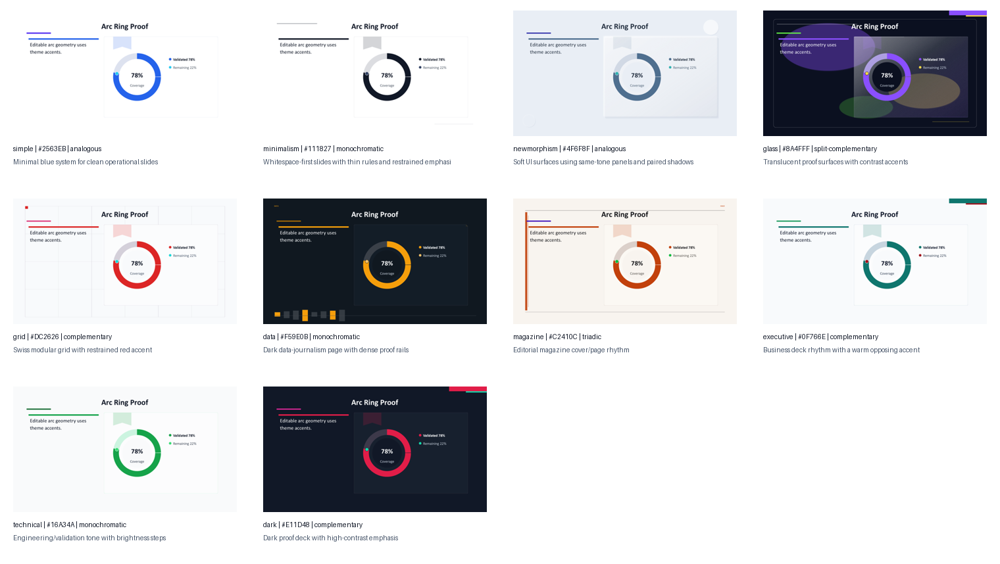

# mdpr-skill

`mdpr-skill` is a thin Codex skill companion for
[MDPR](https://github.com/ch040602/MdPr).

Use this repository when you want LLM-advised presentation review around MDPR:
compact semantic hints, icon-keyword ideas, visual-review loops, and review
artifacts. MDPR remains the deterministic presentation runtime.

For LLM-advised high-quality output, run the skill before MDPR finalizes the
deck. For normal Markdown-to-PPTX generation, use MDPR directly.

Positioning:

```text
MDPR is the deterministic runtime. mdpr-skill is the optional agent review
companion. The LLM can suggest; MDPR renders.
```

Star, bug reports, Markdown edge cases, and PPTX feature requests should go to
the main MDPR repository:

- MDPR: https://github.com/ch040602/MdPr
- npm CLI: https://www.npmjs.com/package/@mdpresent/cli
- Preview gallery: https://ch040602.github.io/MdPr/theme-preview/
- New issue: https://github.com/ch040602/MdPr/issues/new/choose



## Difference from MDPR

| Area | MDPR | mdpr-skill |
| --- | --- | --- |
| Primary role | Markdown-to-presentation runtime | Optional Codex skill wrapper |
| Runtime dependency | No LLM required | Agent used only for hints and review |
| Final decisions | Parsing, splitting, layout, theme colors, typography, charts, tables, diagrams, icon catalog search, PPTX objects, validation | Short intent/grouping/importance/icon-keyword hints and critique notes |
| Install path | `npm install -g @mdpresent/cli` | `git clone` this repository for Codex skill workflows |
| Output | Editable PPTX, HTML, PDF, reports, previews | Hint files, review artifacts, generated review decks |
| Safety boundary | Builds must work without hints | Must not choose final coordinates, colors, z-order, arrows, geometry, exact icons, or renderer object IDs |

## Repository Structure

```text
skills/             Codex skill instructions for the optional wrapper
docs/               Skill-side guides, handoff notes, and preview materials
scripts/            Installation, review, validation, and artifact helpers
design_components/  Source-neutral review seeds and design grammar scaffolds
artifacts/          Generated review/example outputs
reports/            Local validation reports
schemas/            Hint, rulebook, and intermediate schema contracts
packages/change-core/  Approval lifecycle helpers for proposed changes
todo/               Development and review-driven task records
```

MDPR source code is not vendored in this repository. The installer prepares a
local MDPR checkout for development and validation; that local checkout is an
install artifact, not the mdpr-skill repository structure. See
[docs/mdpr-installation.md](docs/mdpr-installation.md).

## Installation

Install MDPR for normal Markdown-to-PPTX usage:

```bash
npm install -g @mdpresent/cli
mdpresent build deck.md --to pptx,html --out dist
```

Install this optional skill repository when you want Codex-assisted review,
hint generation, and local validation artifacts around MDPR output:

```bash
git clone https://github.com/ch040602/mdpr-skill.git
cd mdpr-skill
npm install
```

For skill development and validation, prepare or refresh a local MDPR source
checkout:

```bash
npm run install:mdpr
```

Use an existing MDPR checkout when needed:

```bash
MDPR_SOURCE_DIR=/path/to/mdpr npm run install:mdpr
```

Verify the MDPR handoff:

```bash
npm run check:mdpr
npm run check:mdpr-pandoc
```

## Usage

Run MDPR directly when you only need deterministic presentation output. MDPR is
where parser, layout, theme, object, and renderer changes should land.

Run mdpr-skill when you want a review pass before MDPR builds or rebuilds the
deck:

```text
Markdown source
  -> optional mdpr-skill semantic hints and review notes
  -> MDPR deterministic parsing, layout, validation, and rendering
  -> editable PPTX / HTML / PDF
```

The skill is most useful for workflows where an agent can improve the source
and review the generated artifacts, but should not own the final slide layout:

- compact semantic tags for ambiguous Markdown
- icon-search keyword ideas
- safe edit-intent proposals for page, emphasis, layout-family, and decoration-family changes
- coherence and visual policy findings with evidence paths
- Markdown cleanup suggestions before MDPR builds
- review loops that turn generated PPTX/PNG issues into MDPR rule improvements

`eval-core` can run a deterministic baseline MDPR build, rerun MDPR with a
schema-valid `agent-hint.json`, compare quality and performance metrics, and
emit an `mdpr-skill-eval-v1` report. The comparison gate tracks overflow,
coherence warnings, visual errors, text clipping risk, contrast failures,
connector warnings, font-floor regressions, slide-count drift, output size, and
build-time regressions; it does not choose final slide coordinates or styles.
See [eval-core runner](docs/eval-core.md).
See [three-rail implementation status](todo/phase-18-three-rail-implementation-status.md)
for the current completion analysis and remaining TODOs around hint, review,
approved override, pack, and future `mdpr-ppt` boundaries.

Allowed skill outputs:

- semantic intent tags
- grouping and importance hints
- icon-search keyword ideas
- visual concern notes with evidence paths
- Markdown cleanup suggestions

Forbidden skill outputs:

- final coordinates
- exact colors
- z-order
- arrow geometry
- shape geometry
- renderer object IDs
- exact icon asset choices

## PowerPoint Bridge Boundary

Future PowerPoint selection workflows are split into three rails:

- `hint rail`: `mdpr-skill` emits weak `agent-hint.json` semantics only.
- `review rail`: `mdpr-skill` emits `review-report.json` findings only.
- `edit-intent rail`: `mdpr-skill` records page or decoration change requests
  as safe proposals, not final geometry.
- `approved override / pack rail`: a user-approved `mdpr-ppt` bridge may emit
  override or pack candidates for MDPR to validate and apply.

See [MDPR PowerPoint bridge boundary](docs/mdpr-ppt-bridge.md) for the schema
and approval contract.

## Validation

Run the local validation pack:

```bash
npm run validate
```

Run the theme-decoration review deck loop:

```bash
npm run review:theme-decoration
```

Run the external Markdown visual evaluation loop:

```bash
npm run eval:external-md
```

Generated review artifacts include:

- `artifacts/release-check/mdpr-skill-release-check.md`
- `artifacts/release-check/mdpr-skill-release-check.pptx`
- `artifacts/release-check/mdpr-skill-release-check-report.json`
- `artifacts/theme-decoration-review/theme-decoration-review.pptx`
- `artifacts/theme-decoration-review/theme-decoration-review-iteration-report.json`
- `docs/assets/theme-style-cover-contact-sheet.png`
- `docs/assets/theme-style-proof-contact-sheet.png`
- `docs/assets/theme-decoration-review-matrix.png`
- `docs/assets/pipeline-overview.pptx`
- `docs/assets/pipeline-overview.png`
- `artifacts/external-markdown-visual-eval/external-markdown-visual-eval-report.json`
- `artifacts/external-markdown-visual-eval/iteration-04/build/deck.pptx`
- `artifacts/external-markdown-visual-eval/iteration-04/contact-sheet.png`
- `artifacts/mdpr-vs-skill/mdpr-baseline-result.pptx`
- `artifacts/mdpr-vs-skill/mdpr-skill-result.pptx`

The public repository stores aggregate reference metrics and derived structural
grammar only. It does not store source URLs, downloaded reference PPT files,
source thumbnails, copied layouts, copied images, or brand-like objects from the
reference corpus.

## Documentation

- [Contributing guide](CONTRIBUTING.md)
- [MDPR installation and handoff](docs/mdpr-installation.md)
- [Agent hint guide](docs/agent-hint-guide.md)
- [Eval-core runner](docs/eval-core.md)
- [MDPR PowerPoint bridge boundary](docs/mdpr-ppt-bridge.md)
- [MDPR vs skill results](docs/mdpr-vs-skill-results.md)
- [Structural pattern taxonomy](docs/structural-pattern-taxonomy.md)
- [Actions page materials](docs/actions-page-materials.md)

MDPR runtime documentation lives in the MDPR repository:

- [MDPR](https://github.com/ch040602/MdPr)
- [mdpr-skill](https://github.com/ch040602/mdpr-skill)

## Acknowledgements

This skill uses source-neutral design vocabulary and local SVG/icon references.
Relevant upstream references include:

- [MDPR](https://github.com/ch040602/MdPr)
- [Google Material Design Icons](https://github.com/google/material-design-icons)
- [Simple Icons](https://github.com/simple-icons/simple-icons)
- [SVG Repo](https://www.svgrepo.com/)
- [Tabler Icons](https://github.com/tabler/tabler-icons)
