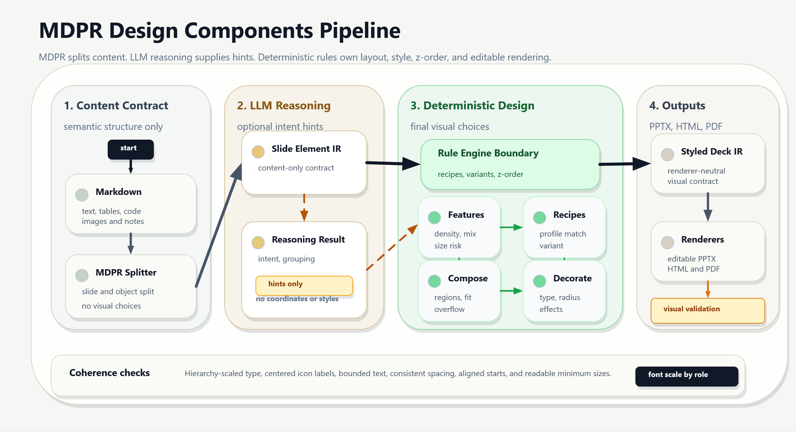

# MDPR Agent Hint Skill Pack



The LLM is an assistant, not the design authority. It may propose compact semantic hints, but all final design choices are made by deterministic rules inside MDPR.

## LLM Usage Boundary

This repository may use an LLM only before deterministic selection, and only to suggest compact semantic hints such as slide intent, grouping candidates, importance candidates, or ambiguity notes. The LLM must not choose slide splits, recipes, variants, coordinates, dimensions, colors, typography, z-order, arrows, effects, or renderer-specific objects.

MDPR itself is a no-LLM runtime. Markdown parsing, Pandoc normalization, slide splitting, graph/diagram preservation, layout, rendering, and validation must work deterministically with the LLM disabled.

The pipeline is documented in `pipeline.md`. The pipeline image is generated from that Markdown source as `docs/assets/pipeline-overview.svg`, embedded into a one-slide PowerPoint deck at `docs/assets/pipeline-overview.pptx`, and exported as a high-resolution PNG through Microsoft PowerPoint. The current diagram shows MDPR parsing, graph preservation, minimal agent hints, deterministic recipe/theme/object selection, editable renderers, and a proof-point validation gate. The stored placement plan at `docs/assets/pipeline-overview-layout.json` is aligned through PowerPoint `ShapeRange.Align` before rendering. SVG is used for stable rounded corners, fixed arrowheads, centered icon-label pairs, card-specific glyphs, role-scaled typography, and explicit padding around text. The generation report verifies child-shape containment, arrow connection levels, role-consistent arrow styles, icon-label alignment, readable font bounds, and PPT-compatible shadow rendering.

Visual diversification seeds in `design_components/design-source-adapter/seeds/visual-diversification-seeds.json` are reference material for MDPR implementation and optional agent hints. Runtime design logic belongs in MDPR packages, not in this skill repository.

The integrated MDPR-only proof deck is stored at `artifacts/mdpr-integrated/mdpr-build/deck.pptx`, with PowerPoint-exported previews in `artifacts/mdpr-integrated/powerpoint-export/` and a contact sheet at `artifacts/mdpr-integrated/mdpr-integrated-contact-sheet.png`. It is generated from `artifacts/mdpr-integrated/mdpr-integrated-demo.md` through the MDPR CLI, not through the earlier handmade prototype renderer. The validation report verifies native chart/table output, editable text boxes, PowerPoint-rendered PNG content, and a 15pt minimum detected text size.

The chart proof-object deck is stored at `artifacts/chart-proof-objects/dist/deck.pptx`, with PowerPoint-exported previews in `artifacts/chart-proof-objects/powerpoint-png/`, a contact sheet at `artifacts/chart-proof-objects/contact-sheet.png`, and a report at `artifacts/chart-proof-objects/validation-report.json`. It is generated through MDPR from `artifacts/chart-proof-objects/chart-proof-objects.md` and demonstrates editable `arc-ring`, `gauge`, and `connected-strip` chart proof objects beside a native PowerPoint bar chart baseline. The report verifies separated TOC text boxes, one native chart part for the baseline, no native chart parts on proof-object slides, and minimum rendered text size of at least `14pt`.

The introduction decks are stored under `artifacts/intro-decks/`. `theme-gallery/deck.pptx` repeats the reusable LLM-hint source across all 14 MDPR built-in themes, while `element-catalog/deck.pptx` lists the currently usable object families: cover/title, paragraph, ordered and unordered list cards, quote callouts, code windows, single-card, comparison, vertical-list, 2x2 grid, 3x2 grid, pentagon/radial cards, native tables, native charts, chart-beside-prose, chart-plus-table, gauges, segmented arc rings, connected strips, ranked bars, metric dots, pipeline diagrams, text-icon-aside, image focus, image beside text, preset backgrounds, region surfaces, accent rails, number badges, icon badges, proof callouts, theme colors, and template assets. Both decks are generated from reusable English bullet-style Markdown sources (`mdpr-intro-refined.md` and `element-catalog-refined.md`) through MDPR, exported by Microsoft PowerPoint to PNG, and summarized in `validation-report.json`.

MDPR color selection follows Adobe Color Wheel harmony rules through `theme.colorCombination`: `preset`, `monochromatic`, `analogous`, `complementary`, `split-complementary`, and `triadic`. The derived palette uses base-color harmony offsets plus saturation/lightness tuning, feeds element colors and chart color tokens, and registers the resulting palette into the generated PowerPoint document theme (`accent1` through `accent6`).

Review guidance still checks WCAG contrast-ratio expectations for readable text and emphasis colors before accepting generated PPTX artifacts.

Text-only slides may use one quiet `monotone-icon-aside` slot when they would otherwise feel visually flat. The icon must be black or white, sourced from PowerPoint built-in icons or a licensed free SVG, and placed in a secondary aside/corner region without competing with the text.

The seed gallery at `docs/assets/infographic-seed-gallery.png` is generated from those rules as SVG, embedded in PowerPoint, and exported as PNG. It demonstrates cycle, ordered, and ranked infographic families for teaser-grade pages that need to place emphasis by text length and importance.

The graph/diagram selection rules also include PPT BIZCAM-inspired chart families such as arc-ring charts, gauge dials, line-graph backgrounds, connected chart strips, target-ring frames, and pictorial metaphor charts. These are selected from MDPR metadata before rendering, not copied from external templates.

This repository is a Codex skill and implementation TODO pack for adding optional agent hints and review workflows around MDPR's deterministic visual-diversification pipeline.

It is explicitly based on these upstream projects:

- Design Components: external-design-source
- MDPR: https://github.com/ch040602/mdpr, also resolved by GitHub as https://github.com/ch040602/MdPr

The local skill drafts in `skills/mdpr-design-components` and `skills/mdpr-design-review` use MDPR as the Markdown presentation splitter, layout engine, and renderer. The MDPR implementation surface lives in `.cache/mdpr/packages/*`; `design_components/` and `third_party/design-source/` are attribution, license, migration, and reference-seed boundaries, not runtime homes for final design decisions.

## Goal

MDPR remains responsible for content structure and visual output: parsing Markdown, splitting slides, splitting elements, selecting layouts, applying design presets, deriving color combinations, rendering editable PPTX/HTML/PDF, and validating overflow/coherence. This skill repository only adds optional semantic hinting, review checklists, and packaging guidance.

```text
Markdown
  -> MDPR Element Splitter
  -> MDPR Presentation IR
  -> optional agent semantic hints
  -> MDPR Layout / Design / Renderer Rules
  -> Renderer(PPTX/HTML/PDF)
```

## MDPR Boundary and Pandoc Mode

MDPR and this skill pack have separate responsibilities. MDPR owns Markdown-to-slide structure, visual diversification, and rendering, including the Pandoc-backed parser mode. This skill pack may only add semantic hints before deterministic MDPR selection.

```text
Markdown
  -> MDPR parser(simple or Pandoc)
  -> MDPR BlockIR
  -> MDPR Outline Tree
  -> MDPR Split Planner
  -> MDPR Presentation IR
  -> optional agent semantic hints
  -> MDPR deterministic visual diversification
```

Use Pandoc mode in MDPR when Markdown needs richer structural normalization before slide splitting:

```bash
mdpresent build deck.md --parser pandoc --to pptx,html --out dist
```

The default parser remains MDPR's built-in simple parser. Pandoc mode requires the `pandoc` executable on `PATH`, normalizes Pandoc JSON into the same MDPR `BlockIR`, and does not choose design recipes, colors, shapes, infographic families, z-order, or typography. See `docs/mdpr-pandoc-integration.md`.

## Difference from MDPR

This project does not replace MDPR. It keeps MDPR as the runtime owner and supplies a skill wrapper that can help agents produce small semantic hints, run reviews, and verify that MDPR's deterministic renderer remains coherent.

| Area | Existing MDPR | This project |
| --- | --- | --- |
| Primary role | Deterministic Markdown-to-presentation runtime | Codex skill wrapper for semantic hints and review |
| Visual decisions | Owns layout, design presets, color combinations, PPT theme colors, typography, tables, diagrams, and rendering | Must not choose final coordinates, colors, variants, effects, z-order, or renderer objects |
| LLM/agent role | Not required at runtime | Optional short semantic tags only |
| Intermediate contract | Presentation IR and Layout IR | Hint/checklist files that MDPR may ignore safely |
| PPTX output target | Editable PowerPoint objects with theme-color binding and overflow validation | Visual QA guidance and generated comparison artifacts |
| Validation focus | Build success, text bounds, table coherence, theme color output, diagram integrity | Review-driven checks that catch boundary drift |

## Improvements Over the Base Flow

- **Deterministic design decisions in MDPR:** layout, placement, spacing, decoration, table handling, diagram rendering, and theme-color binding are selected by inspectable MDPR rules rather than ad hoc generation.
- **Stronger renderer contracts:** MDPR `Presentation IR` and `Layout IR` carry renderer-neutral structure into PPTX, HTML, and PDF renderers.
- **Editable PPTX-first behavior:** generated PowerPoint decks use editable shapes, text boxes, tables, charts, pictures, theme colors, and verified z-order instead of relying only on flattened visual output.
- **Editable chart proof objects:** MDPR supports native `bar` charts and editable `arc-ring`, `gauge`, `connected-strip`, `ranked-bars`, and `metric-dots` proof-object charts for score/progress/flow slides that should not rely on flattened images.
- **Material-style icon slots:** text-only relief and item-card badges use restrained monochrome icons inspired by Google Material Icons' 24px design box, centered in their slot and kept secondary to text.
- **Numeric parallel layouts:** MDPR can place short prose beside a chart and can keep charts and tables in parallel regions when the slide needs both quantitative and tabular evidence.
- **Coherence validation:** visual profiles enforce consistent accent usage, radius family, shadow family, readable font sizes, bounded text, aligned icon-label pairs, and consistent arrow semantics.
- **Adobe Color Wheel harmony:** MDPR `theme.colorCombination` selects `monochromatic`, `analogous`, `complementary`, `split-complementary`, or `triadic` rules and writes derived accents into the PowerPoint document theme.
- **Lower token usage:** optional agent hints are reduced to compact intent/grouping tags; deterministic rules perform the expensive design selection work without repeated model reasoning.
- **Traceable style output:** style gallery, inspect output, render reports, and placement plans make it possible to compare profiles and debug why a deck looks the way it does.

## Core Rules

1. **Rule-based selection only**
   Slide recipes and element variants are selected by deterministic rules, not by an agent.

2. **Agents may provide reasoning hints only**
   Agents may help infer intent, group, or importance candidates. They must not choose recipes, variants, coordinates, colors, or effects directly.

3. **MDPR owns design execution**
   MDPR owns `x/y/w/h`, color, typography, table, diagram, chart-token, effect, z-order, and renderer-object decisions.

4. **The skill only hints**
   This repository may suggest intent, grouping, importance, ambiguity, or validation focus. It must not carry final visual instructions.

5. **PPT colors bind to theme slots**
   Final PPTX output should use scheme/theme slots such as `accent1`, `text1`, and `background1` instead of hardcoded hex values by default.

6. **Color harmony follows Adobe Color Wheel rules**
   MDPR config declares `theme.colorCombination`, and the derived palette feeds elements, chart color tokens, and PPT document theme colors.

## Pipeline Mode

The new mode name is:

```text
design-components-rule-based
```

New MDPR design behavior must be opt-in through MDPR flags or config when it changes visible output. Existing MDPR builds should continue to work with `theme.colorCombination: preset`.

The project reference directory for Design Components-derived design seeds is:

```text
design_components/
```

`design_components/` contains migration references, seed catalogs, and prototype policies. Production design execution should be moved into MDPR core/layout/renderer packages.

## Theme Gallery vs. Style Gallery

`theme-gallery` belongs to MDPR's theme/design-preset path. It varies MDPR theme presets without changing the core layout pipeline.

There is no separate `style-gallery` runtime in this repository. Any future visual gallery should be implemented in MDPR or generated as review artifacts by this skill.

## Repository Contents

```text
00_EXECUTIVE_SUMMARY.md          Executive summary
01_TARGET_ARCHITECTURE.md        Target architecture
02_ROADMAP_TODO.md               Phase-by-phase roadmap
03_MILESTONES_AND_ACCEPTANCE.md  Milestones and acceptance criteria
04_PACKAGE_TODO.md               Package-level TODOs
05_RULE_ENGINE_SPEC.md           Rule engine design
06_IR_CONTRACTS.md               Element IR and Styled Deck IR contracts
07_PPT_THEME_COLOR_SPEC.md       PPT theme color policy
08_AGENT_BOUNDARY.md             Agent boundary
09_TEST_PLAN.md                  Test plan
10_MIGRATION_PLAN.md             Migration plan from existing MDPR
11_CLI_AND_CONFIG.md             CLI and config design
12_DESIGN_SOURCE_PORT.md             Design Components source port plan
13_IMPLEMENTATION_NOTES.md       Implementation notes
TODO_INDEX.md                    Recommended execution order

todo/                            Phase checklists
schemas/                         Draft JSON schemas
examples/                        Sample config, rulebook, profile, and inspect output
src-scaffolds/                   TypeScript scaffolds
packages/                        Package-level TODOs
design_components/               Reference seeds and migration prototypes
skills/                          Codex skill drafts
.github/                         Issue and PR template drafts
adr/                             Architecture decision records
```

## Recommended Start

1. Read `02_ROADMAP_TODO.md` to understand the implementation scope.
2. Start with `todo/phase-00-preflight.md`.
3. Use `schemas/slide-element-ir.schema.json` and `src-scaffolds/element-ir-types.ts` as the first Element IR references.
4. Use `examples/rulebook.sample.yaml` as the minimal rulebook seed for selector work.
5. Do not begin renderer integration until Styled Deck IR is stable enough for snapshot testing.

## Installing With MDPR

Install this skill pack with MDPR prepared alongside it:

```bash
npm install
```

The `postinstall` hook runs `python scripts/install_mdpr.py`, which clones or updates MDPR from `https://github.com/ch040602/mdpr` into `.cache/mdpr` by default. This keeps MDPR available as the Markdown parsing, element-splitting, layout, design, and rendering runtime while this repository supplies optional agent hints and review assets.

Use an existing local MDPR checkout when needed:

```bash
MDPR_SOURCE_DIR=/path/to/mdpr npm install
```

Install MDPR's own package dependencies explicitly:

```bash
npm run install:mdpr
```

Verify that the installed MDPR checkout includes the structured Pandoc parser boundary:

```bash
npm run check:mdpr-pandoc
```

See `docs/mdpr-installation.md` for `MDPR_INSTALL_DIR`, `MDPR_REF`, `MDPR_REPO_URL`, and `MDPR_SKIP_INSTALL` options.

## Local Validation

Run the pack validator before release:

```bash
npm test
```

The validator checks required reference scaffold files, JSON syntax, README/SOURCES attribution, catalog coverage, and closure of Markdown checklists.

It also runs the Design Components source coverage check and PowerPoint render comparison:

```bash
npm run inventory:design
npm run verify:ppt
npm run compare:ppt
npm run infographic:gallery
npm run showcase:ppt
npm run compare:mdpr-skill
```

PowerPoint render artifacts are written under `artifacts/ppt/`. The comparison uses Microsoft PowerPoint COM export to render the generated PPTX to PNG, then compares it with the XML-derived visual proof and overlap pixel samples.

## Guides

- `docs/rulebook-authoring-guide.md`
- `docs/profile-authoring-guide.md`
- `docs/renderer-capability-guide.md`
- `docs/ppt-theme-color-guide.md`
- `docs/agent-hint-guide.md`
- `docs/migration-guide.md`
- `docs/release-checklist.md`
- `docs/mdpr-installation.md`
- `docs/mdpr-pandoc-integration.md`
- `docs/monotone-icon-slot-guide.md`
- `docs/mdpr-vs-skill-results.md`
- `docs/infographic-seed-guide.md`
- `docs/design-source-port-coverage.md`
- `docs/ppt-visual-validation.md`
- `docs/component-showcase.html`

## Component Showcase

`docs/component-showcase.html` introduces representative renderer-neutral mappings for editable shapes, layered z-order stacks, chart/KPI surfaces, buttons, tables, timeline/process rails, modal/sheet surfaces, and motion fallbacks.

## Design Seed Structure

Design Components concepts are kept as project-owned reference modules rather than copied into the upstream reference folder:

- `design_components/rule-engine`: prototype feature extraction and selection ideas to migrate into MDPR when accepted.
- `design_components/composition`: prototype layout primitives and fit constraints for MDPR layout planning.
- `design_components/decoration`: token, surface, border, radius, shadow, and coherence lint references for MDPR renderers.
- `design_components/design-source-adapter`: upstream Design Components token, skin, motion, and component mapping references.
- `design_components/pptx`: prototype editable PPTX object and theme-color binding references.

The visual diversification seed pack adds reusable infographic patterns such as `proof-point-callout`, `editorial-annotation`, `connected-rail`, `contrast-chip`, `metric-swatch`, and `monotone-icon-aside`. These seeds are intended for PPTX, HTML, and PDF renderers so point elements such as validation markers can use distinct structure, contrast color, quiet icons, and alignment rules while staying coherent with the slide.

The design showcase also includes a `mixed-object-stress` slide that combines a raster image, editable text, auto shapes, KPI cards, a native PowerPoint chart, a native PowerPoint table, timeline objects, badges, and callouts in one coherent visual profile. Coherence validation includes a readability rule that every explicit text run must be at least `font size >= 8pt`.

The exported design showcase is intentionally rendered in reverse order: `mixed-object-stress -> notion -> linear -> stripe -> toss`. The generated `design_showcase_report.json` records this in `showcaseOrder`, and `showcase_slide_1.png` is the mixed-object stress test.

## Render Comparison Artifacts

- `artifacts/ppt/design_components_z_order_validation.pptx`
- `artifacts/ppt/design_components_z_order_validation.png`
- `artifacts/ppt/powerpoint_render.png`
- `artifacts/ppt/z_order_report.json`
- `artifacts/ppt/powerpoint_render_compare.json`
- `artifacts/design-showcase/design_components_showcase.pptx`
- `artifacts/design-showcase/showcase_slide_1.png`
- `artifacts/design-showcase/showcase_slide_2.png`
- `artifacts/design-showcase/showcase_slide_3.png`
- `artifacts/design-showcase/showcase_slide_4.png`
- `artifacts/design-showcase/showcase_slide_5.png`
- `artifacts/design-showcase/assets/mixed_object_reference.png`
- `artifacts/design-showcase/design_showcase_report.json`
- `docs/assets/infographic-seed-gallery.svg`
- `docs/assets/infographic-seed-gallery.pptx`
- `docs/assets/infographic-seed-gallery.png`
- `docs/assets/infographic-seed-gallery-report.json`
- `artifacts/mdpr-vs-skill/mdpr-baseline-result.pptx`
- `artifacts/mdpr-vs-skill/mdpr-skill-result.pptx`
- `artifacts/mdpr-vs-skill/mdpr-vs-skill-report.json`
- `artifacts/intro-decks/theme-gallery/deck.pptx`
- `artifacts/intro-decks/element-catalog/deck.pptx`
- `artifacts/intro-decks/theme-gallery-contact-sheet.png`
- `artifacts/intro-decks/element-catalog-contact-sheet.png`
- `artifacts/intro-decks/validation-report.json`

## Design Showcase Deck

`artifacts/design-showcase/design_components_showcase.pptx` is a rendered PowerPoint deck built from the existing Design Components project references. It uses the Toss, Stripe, Linear, and Notion skins and ports representative Design Components patterns such as `stat-card`, `chart-card`, `ranked-list`, and `insight-card` into editable PowerPoint text and shape objects. The generated report checks that each rendered slide has visible content, that every slide keeps a coherent accent, radius family, shadow family, and minimum readable text size, and that the stress slide contains picture, table, chart, text, and auto-shape object types.

## Supported MDPR Commands

Use MDPR-owned command/config surfaces:

```bash
mdpresent build deck.md --design executive --to pptx
mdpresent build deck.md --theme-gallery executive,nord,dracula,solarized --to pptx
mdpresent build deck.md --config examples/basic/mdpresent.config.yaml --to pptx,html
```

## Attribution and Licensing

Design Components upstream metadata is tracked in `SOURCES.md` and `third_party/design-source/UPSTREAM.md`. Design Components is recorded as MIT-licensed in the vendoring plan; keep its license notice with any copied or adapted upstream content. Project-owned adaptations belong under `design_components/`, not under `third_party/design-source/`.
